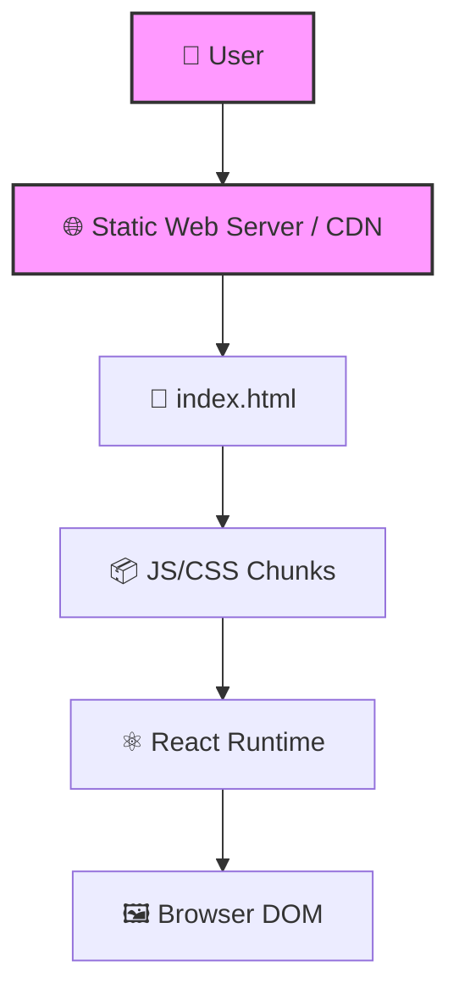

# 🌐 Site React 1 (Production Build)

A production-optimized build of a React Single-Page Application (SPA).

## 🚀 Overview

This repository contains the static, minified files representing the production build of **site_react_1_070221**. These files are optimized for the best performance and are ready to be served by any static file server (e.g., Nginx, Apache, or a CDN).

## 🛠 Technology Stack

- **Output**: Minified HTML, CSS, and Javascript
- **Framework**: React (bundled via Webpack)
- **Assets**: Optimized images and progressive web app (PWA) manifest

## 🏗 Architecture / Workflow



## ⚙️ Quick Start

Because this is a production build, you don't need `npm install` or a development server. You can serve the static files directly:

1. Clone the repository: `git clone https://github.com/iv150320/site_react_1_070221-build_7.git`
2. Serve the directory with any HTTP server. For example:
   ```bash
   npx serve .
   # OR
   python3 -m http.server 8080
   ```
3. Open `http://localhost:8080` (or the port specified by your server) in a web browser.

---
**Author**: @iv150320
